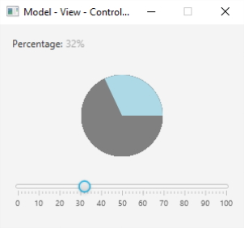

Programmation Java @ Et3 \
Polytech Paris-Saclay | 2024-25

___

# TP3

Le but de ce TP est de comprendre comment s'implémente un pattern [*Modèle - Vue - Contrôleur*](https://baptiste-wicht.developpez.com/tutoriels/conception/mvc/).

Ce programme devra contenir :

  - un modèle : *Model.java*, implémentant une interface *ModelInterface.java* (situés dans le package *model*).
  - un contrôleur : *Controller.java*, implémentant une interface *ControllerInterface.java* (situés dans le package *controller*).
  - quatre vues : *ConsoleView.java*, *LabelView.java*, *PieChartView.java*, *SliderView.java*, implementant une interface *ViewInterface.java* (situées dans le package *view*).

 
</img>
 

Chacune des vues a un comportement propre :
 - *ConsoleView* affiche un message dans la console à chaque fois que le modèle change.
 - *LabelView* affiche, dans un [*Label*](https://docs.oracle.com/javase/8/javafx/api/javafx/scene/control/Label.html), l'état actuel du modèle.
 - *PieChartView* affiche un graphique correspondant à l'état actuel du modèle. Cette vue permet également à l'utilisateur de manuellement transformer ce graphique, s'il réalise un clic ou un drag sur celui-ci.
 - *SliderView* actualise la position du curseur d'un slider en accord avec l'état actuel du modèle. Cette vue permet également à l'utilisateur de manipuler directement ce curseur pour mettre à jour le modèle.

1. Importez ce projet dans votre IDE.

> Pour importer ce projet dans Eclipse, suivez les étapes suivantes :
>   1) Allez dans *File* > *Import...*;
>   2) Sélectionnez *Git* > *Projects from Git*;
>   3) Sélectionnez *Clone URI*;
>   4) Dans *URI:*, entrez "https://github.com/polytech-ihm-et3/TP1_squelette.git" (les autres champs devraient se remplir automatiquement);
>   5) Cliquez sur "*Next >*" pour toutes les étapes suivantes, puis sur "*Finish*".
>   
> Pour visualiser les tâches à réaliser dans ce projet avec Eclipse, allez dans "*Window*" > "*Show View*" > "*Tasks*".

> Pour importer ce projet dans IntelliJ, suivez les étapes suivantes :
>   1) Allez dans *File* > *New* > *Project from Version Control...*;
>   2) Sur la droite, sélectionnez *GitHub*;
>   3) Dans la barre de recherche, en haut, inscrivez "https://github.com/polytech-ihm-et3/TP1_squelette.git";
>   4) Cliquez sur *Clone*.
>   
> Pour visualiser les tâches à réaliser dans ce projet avec IntelliJ, allez dans "*View*" > "*Tool Windows*" > "*TODO*".

2. Réalisez un diagramme UML de cette application, afin de bien comprendre les relations entre les différentes entités qui la compose. Faites vérifier le diagramme par votre encadrant avant de continuer.

3. Ajoutez les quatre vues *ConsoleView*, *LabelView*, *PieChartView*, *SliderView* à la classe principale (*App.java*). Votre interface doit être la plus proche possible de la figure ci-dessus.

4. Complétez la classe *Controller* pour qu'elle fasse le lien entre le modèle et les vues.

5. Implémentez les deux vues *PieChartView* et *SliderView* pour qu'elles mettent à jour le modèle si l'utilisateur les manipule (attention, tout doit passer par le contrôleur).

6. Faites en sorte que les différentes vues aient chacune une méthode permettant de la mettre à jour.

> 1) Implémentez l'interface *ViewInterface* dans chacune des vues.
> 2) Implémentez la méthode suivante, pour qu'elle mette à jour chacune des vues :
> `public void update(double value);`

7. Faites en sorte que les différentes vues reçoivent un événement de type *PercentageValueChangedEvent* si l'état interne du modèle est modifié.

> 1) Commencez par repérer quelle est l'interface que les vues doivent implémenter pour être capable de recevoir des événements de la part du modèle.
> 2) Implémentez la/les potentielle(s) méthode(s) de cette interface de manière cohérente, le but étant de mettre à jour les vues lorsqu'elles reçoivent un événement de la part du modèle.
> 3) Implémentez les méthodes suivantes dans la classe *Controller* pour qu'elles permettent d'ajouter ou de retirer des éléments de la liste des PercentageValueListener du modèle :
> `public void addPercentageValueListener(PercentageValueListener percentageValueListener)`
> `public void removePercentageValueListener(PercentageValueListener percentageValueListener)`
> 4) Ajoutez les vues à la liste des éléments recevant des événements de la part du modèle (attention, tout doit passer par le contrôleur)
> 5) Complétez la méthode suivante dans le modèle, pour qu'elle prévienne les PercentageValueListeners, si l'état interne est modifié
> `public void fireValueChanged()`
